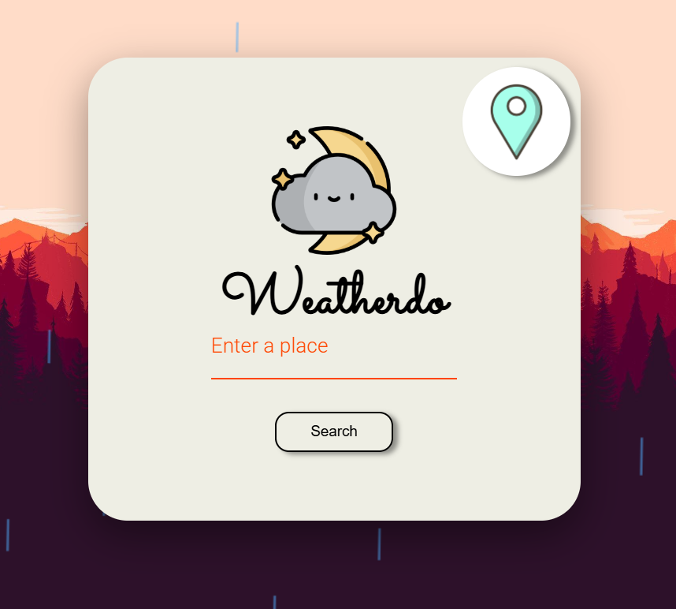
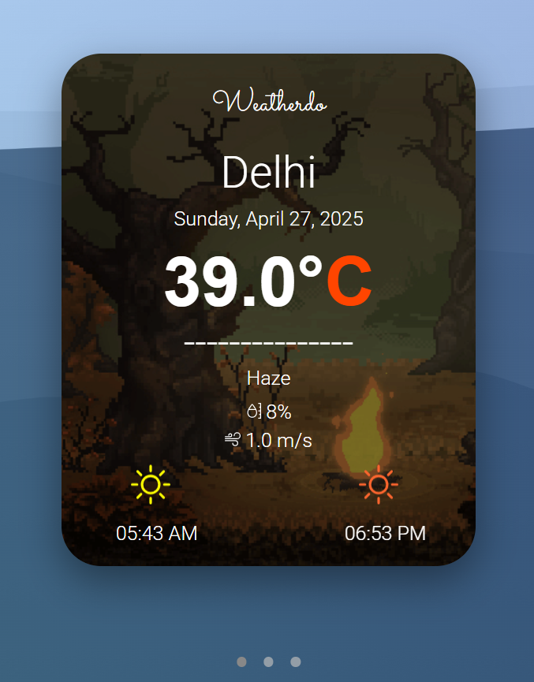

# 🌦️ Weatherdo — Weather Forecast Web Application

Weatherdo is a dynamic and fully responsive weather forecasting web application built using **Vanilla JavaScript**, **HTML5**, and **CSS3**.  
It delivers real-time weather forecasts, air pollution indices, breaking news updates, and interactive maps, all while maintaining high accessibility standards through integrated **text-to-speech narration**.  
This project was developed **without using any frameworks or libraries like React.js, Bootstrap, or TailwindCSS**, to strengthen my core web development skills.

---

## 🎯 Purpose

The primary objective behind building Weatherdo was to **master fundamental JavaScript, DOM manipulation, and API integration** techniques, without relying on external frontend frameworks.  
It emphasizes **pure logic building, accessibility enhancements, and clean UI/UX practices**.

---

## 🛠 Technologies and APIs Used

- **HTML5**, **CSS3**, **Vanilla JavaScript (ES6+)**
- **Leaflet.js** — Interactive Maps
- **OpenWeatherMap API** — Real-time weather forecasts
- **WAQI API** — Air Pollution Index (AQI) data
- **GNews API** — Breaking local news
- **Web Speech API** — Audio narration for accessibility

---

## 🎮 Key Features

- **Real-Time Weather Forecasts:**  
  Fetch and display temperature, humidity, wind speed, sunrise/sunset times based on user location.

- **Dynamic Background Changes:**  
  Background visuals adapt based on weather conditions (rainy, sunny, snowy, foggy).

- **Interactive Mapping:**  
  Detailed maps with markers using Leaflet.js for location-based visualization.

- **Air Quality Monitoring:**  
  Live AQI index readings with advisory messages for user safety.

- **Breaking News Section:**  
  Stay updated with location-specific news headlines using GNews API.

- **Accessibility Support:**  
  Real-time weather details are narrated audibly for visually impaired users.

- **Fully Responsive:**  
  Optimized for mobile, tablet, and desktop screens.

---

## 📸 Snapshots






---

## 🚀 How to Use

1. Clone the repository:
   ```bash
   git clone https://github.com/jasmeet1234/weatherdo.git
   ```
2. Replace API keys with your own (OpenWeatherMap, GNews, WAQI).
3. Open `index.html` in any browser.
4. Search for a location or allow location access to view local forecasts.

---

## ⚠️ Important Notes

- External APIs may have free usage limits or require sign-up.

---
> **A responsive Vanilla JavaScript-based weather app featuring real-time forecasts, AQI tracking, news integration, and accessibility support.**

---

If you want, I can also create a **compressed ultra-clean "minimal" version** in case you want a lighter README for GitHub (some devs prefer that!) 🚀🎯  
Would you like that too?
